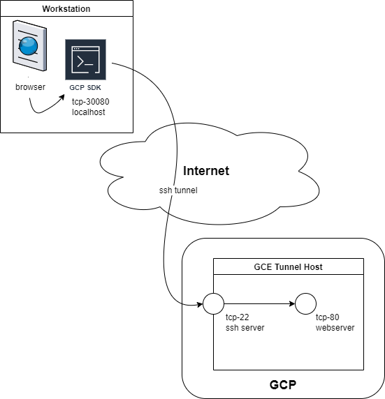
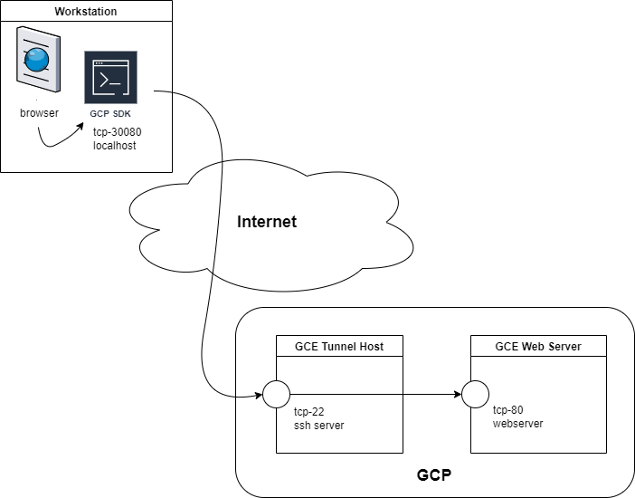
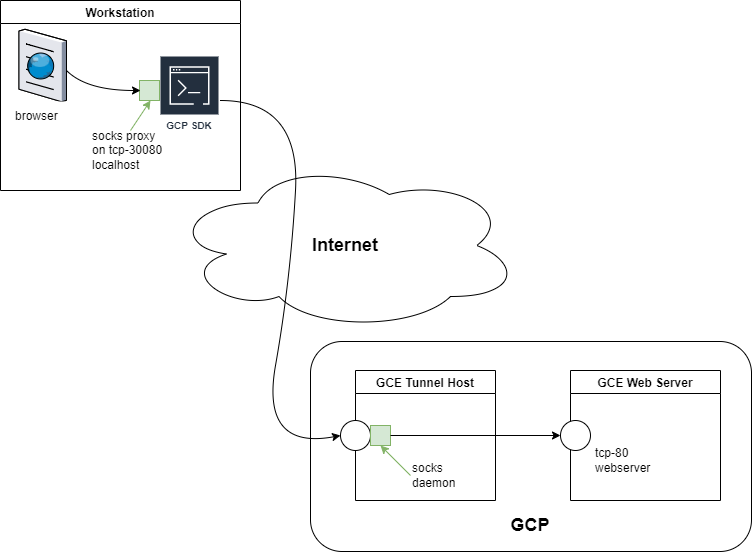

# google-cloud-private-gui-access

[](https://github.com/netserf/google-cloud-private-gui-access/actions)
[](https://github.com/netserf/google-cloud-private-gui-access/actions)

A review of options for accessing remote/hidden GUIs inside Google Cloud when
your organization restricts public IP address access.

Options reviewed:

1. gcloud with SSH tunneling - local host
1. gcloud with SSH tunneling - remote host
1. gcloud to enable SOCKS proxied access
1. IAP for Windows - TODO

## Work Environment

These instructions assume you already have Google Cloud access and you're
working in the Cloud Shell. Clone the repo and follow the build steps below.

```bash
git clone https://github.com/netserf/google-cloud-private-gui-access.git
```

The Terraform steps provided will build out GCE instances that you can use to
test GUI access. Follow the infrastructure build instructions to turn up your
test environment, then follow the test steps to test your GUI access.

Things to Consider:

* If you are inside a private GCP network, then you may need to turn on Cloud
  NAT to enable egress access to the Internet for package updates

## Infrastructure Build

The following are the infrastructure build steps using terraform.

Note - terraform is available in Google's Cloud Shell environment.

```bash
PROJECT_ID="YOUR_PROJECT_ID"
gcloud config set project ${PROJECT_ID}
cd terraform
```

Pull the providers:

```bash
terraform init
```

Review  the plan:

```bash
terraform plan
```

Apply the updates:

```bash
terraform apply
```

## Test Steps

### 1. gcloud with SSH tunneling - local host



```bash
# build tunnel on workstation host
gcloud compute ssh tunnel-instance -- -NL 30080:localhost:80
```

```bash
# test from workstation host
curl -s localhost:30080
```

Notes:

* To test in your browser, try <http://localhost:30080>

### 2. gcloud with SSH tunneling - remote host



```bash
# build tunnel on workstation host
gcloud compute ssh tunnel-instance -- -NL 30080:backend-instance:80
```

```bash
# test from workstation host
curl -s localhost:30080
```

Notes:

* To test in your browser, try <http://localhost:30080>

### 3. gcloud SOCKS proxy



```bash
# build the socks proxy on your workstation host
gcloud compute ssh tunnel-instance --ssh-flag="-D" \
    --ssh-flag="30080" --ssh-flag="-N"
```

```bash
# test from workstation host
curl -x socks5h://localhost:30080 http://tunnel-instance

curl -x socks5h://localhost:30080 http://backend-instance
```

Notes:

* To test in your browser:

  1. set your browser socks proxy to localhost:30080
  1. connect your browser to <http://tunnel-instance>
  1. connect your browser to <http://backend-instance>

### 4. IAP for Windows - TODO

TODO

## Clean Up

```bash
terraform destroy
```
